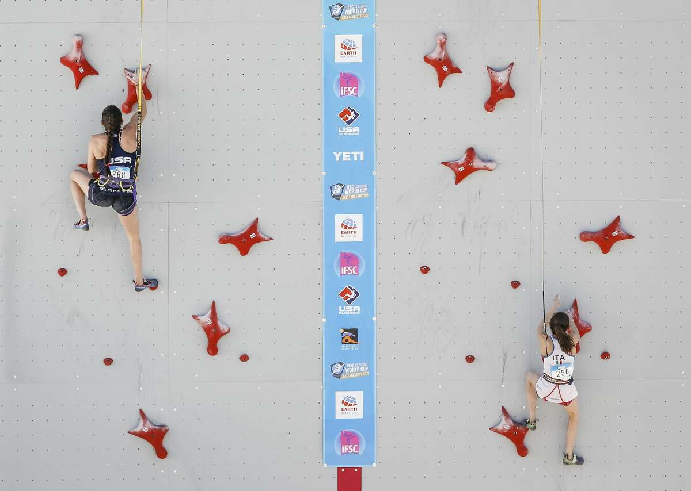
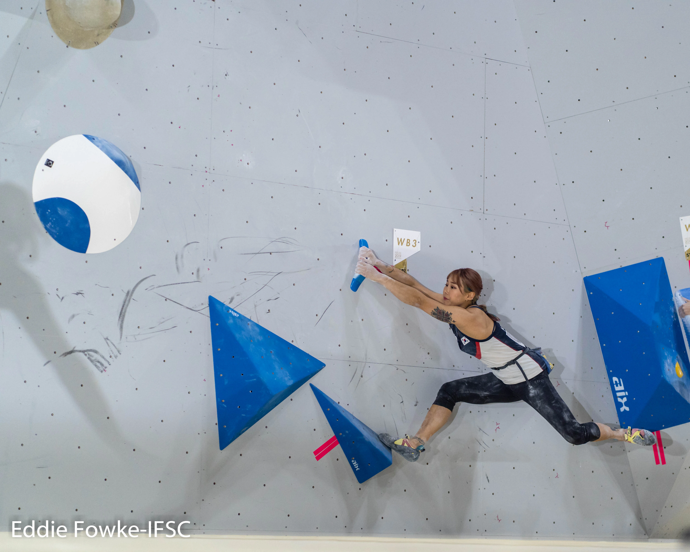

```{r setup, include=FALSE}
knitr::opts_chunk$set(echo = FALSE)

## load required libraries and data
library(ggplot2)
library(dplyr)
library(tidyr)
library(cowplot)

load("./../data/mTimes_skip.Rdata")
load("./../data/wTimes_skip.Rdata")
```


## {.flexbox .vcenter}
<div class = "centered">
<font size="20">**Background**</font>
</div>


  

## Background

- IFSC hosts climbing competitions around the globe
- Three disciplines of climbing: Sport, Bouldering, and Speed
- Announcement of rock climbing in the 2020 olympics caused controversy




 
  

## Tomoa Skip

- Introduced in 2018 by boulderer Tomoa Narasaki
- A new way to start the route
- Groundbreaking in that it introduced a bouldering style to speed climbing

<iframe src="https://www.youtube.com/embed/wTcZWdzGYD4?start=172" title="YouTube video player"  frameborder="0"                allow="accelerometer; autoplay; clipboard-write; encrypted-media; gyroscope; picture-in-picture;  web-share"                  allowfullscreen>
</iframe>


##  {.flexbox .vcenter}
<div class = "centered">
<font size = "20">**Data**</font>
</div>

## Data Available

- Climbing event results are stored on the IFSC website
- Used a web scraper to go through speed climbing events for men and women
- Tomoa skip data was gathered through watching YouTube videos of IFCS final competitions
- Used a spreadsheet to mark whether a climber performed the Tomoa Skip or not
- Tomoa Skip data is only available for climbers in a final
- Script to indicate whether a climber uses the Tomoa Skip based on if they have used it before


## {.flexbox .vcenter}
<div cslass = "centered">
<font size = "20">**Analysis**</font>
</div>

## Users of Tomoa Skip Over Time

```{r message = FALSE, out.width="105%", warning = FALSE}
#Label Names:
label_names <- c('F' = 'Womens', 'M' = 'Mens')

# Number of tomoa skip users per start date
m_times_update |>
  bind_rows(w_times_update) |>
  group_by(sex, start_date) |>
  filter(!is.na(tomoa_skip)) |>
  summarise(num_ts = sum(tomoa_skip), num_no_ts = sum(!tomoa_skip)) |>
  ggplot() +
  geom_point(aes(start_date, num_ts, color = "Tomoa Skip")) + 
  geom_point(aes(start_date, num_no_ts, color = "No Tomoa Skip")) + 
  facet_wrap(.~sex, labeller = as_labeller(label_names)) +
  labs(x="Start Date", y = "Count") + 
  theme(legend.title = element_blank())
```

<div class="notes">
- After introduction of TS in 2018, TS is rapidly adopted
- Use of non-TS beta plumets and TS becomes the norm
</div>

## Best Final vs Best Qualifier Times

``` {r warning = FALSE, out.width = "100%", message = FALSE}
#Best Final and Best Qualifier
m_times_update |>
  # These pivot_longers are producing duplicates
  filter(rank <= 16) |>
  pivot_longer(cols = c("best_qual", "lane_a", "lane_b"), names_to = "qual_round", values_to = "qual_time") |>
  pivot_longer(cols = c("final", "first_round", "quarter", "semi", "small_final", "big_final"), names_to = "final_round", values_to = "final_time") |>
  group_by(fname, lname, sex, event_id, tomoa_skip) |>
  summarise(
    best_qual = ifelse(all(is.na(qual_time)), NA, min(qual_time, na.rm = TRUE)),    
    best_final = ifelse(all(is.na(final_time)), NA, min(final_time, na.rm = TRUE))
  ) |>
  filter(!is.na(best_qual) & !is.na(best_final)) |>
  ggplot() +
  geom_jitter(aes(best_qual, best_final, color = tomoa_skip)) + 
  labs(x = "Best Qualifier Time", y = "Best Final Time") + 
  coord_cartesian(ylim = c(0, 30), xlim = c(0, 30)) + 
  scale_color_discrete(name  ="",
                        breaks=c(TRUE, FALSE),
                        labels=c("Tomoa Skip", "No Tomoa Skip"))

```

<div class="notes">
- Not as linear as expected
- Many Climbers do better in qual than final:
+ Less stress
+ Multiple attempts
+ One fall or FS in final disqualifies
</div>

## Mens Qualifying and Final Times ??
``` {r warning = FALSE, message = FALSE, out.width = "100%"}
# Mens qualifier times 
qual_plot <-m_times_update |>
  pivot_longer(cols = c("best_qual", "lane_a", "lane_b"), names_to = "round", values_to = "qual_time") |>
  group_by(fname, lname, tomoa_skip, sex, event_id, year, start_date) |>
  filter(!is.na(qual_time))  |>
  ggplot() +
  geom_jitter(aes(start_date, qual_time, color = tomoa_skip), show.legend = FALSE) + 
  coord_cartesian(ylim = c(0, 40)) + 
  ggtitle("Qualifying Times for Men") + 
  labs(x = "Start Date", y = "Qualifier Time") + 
  theme(legend.position = "none")

# Mens final times
final_plot <- m_times_update |>
  pivot_longer(cols = c("final", "first_round", "quarter", "semi", "small_final", "big_final"), names_to = "round", values_to = "final_time") |>
  group_by(fname, lname, sex, tomoa_skip, event_id, year, start_date) |>
  # There are 3 outliers of ~100 seconds
  filter(!is.na(final_time))  |>
  ggplot() +
  geom_jitter(aes(start_date, final_time, color = tomoa_skip), show.legend = FALSE) + 
  coord_cartesian(ylim = c(0, 40)) + 
  ggtitle("Final Times for Men") + 
  labs(x = "Start Date", y = "Final Time") 

#Combine two plots
plot_grid(qual_plot, final_plot, ncol = 2) 

```

## Next Steps


